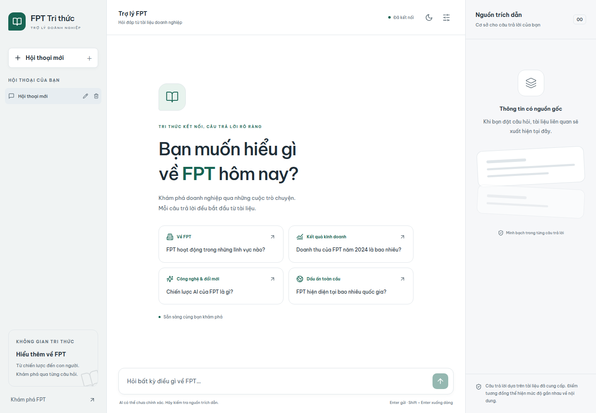
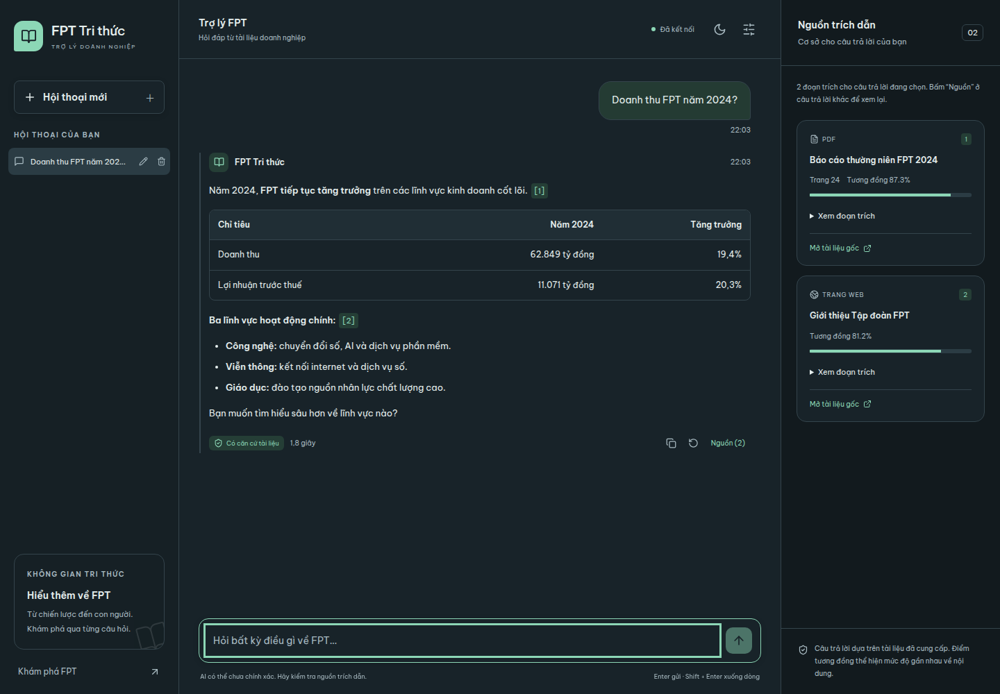
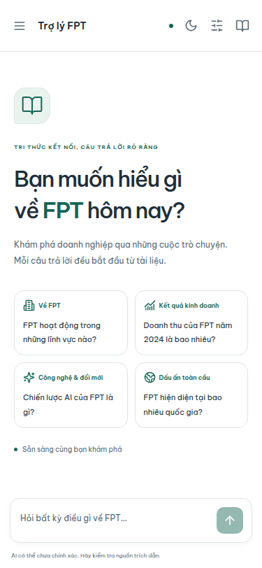

# FPT Tri thức

Trợ lý hỏi đáp tiếng Việt về doanh nghiệp, sử dụng tài liệu FPT để tìm kiếm và trích dẫn nguồn. React 18 + Spring Boot 3.3 + Milvus 2.4 + Ollama; ingestion bằng Python.



## Tính năng

- Giao diện sáng/tối, theo hệ thống hoặc lựa chọn lưu trên trình duyệt. Font Be Vietnam Pro được đóng gói, không cần Google Fonts.
- Desktop ba cột; tablet mở nguồn trong drawer; mobile mở lịch sử/nguồn trong drawer, ô nhập cố định bên dưới.
- Gợi ý câu hỏi, Markdown (bảng, danh sách, code), timestamp, thời gian phản hồi, copy, hỏi lại và badge căn cứ tài liệu.
- Streaming theo token, nút **Dừng**, tự chuyển về API JSON nếu stream lỗi trước token đầu tiên. Stream bị ngắt sau khi đã có nội dung hiển thị lỗi và giữ câu trả lời dở dang.
- Truy xuất 64 ứng viên semantic, xếp lại bằng cosine + độ phủ từ khóa/cặp từ liền nhau và chọn Top K; giữ nguyên score cosine hiển thị.
- Nguồn theo từng câu trả lời, chip `[1]`, `[2]`, tiêu đề, loại tài liệu, trang, điểm tương đồng, đoạn trích đầy đủ và link gốc.
- Nhiều hội thoại và bản nháp lưu trong localStorage; tạo, đổi tên, xóa, tự đặt tiêu đề. Tối đa 50 hội thoại; báo lỗi nếu bộ nhớ trình duyệt đầy.
- Enter gửi, Shift+Enter xuống dòng; hỗ trợ bộ gõ IME. Tự cuộn khi đang ở cuối, nút xuống cuối khi đọc tin cũ.
- Kiểm tra kết nối API mỗi 30 giây; Top K 1–20 trong **Cài đặt**.
- API nhận 12 tin nhắn lịch sử gần nhất. Backend dùng tối đa 6.000 ký tự lịch sử, chỉ để hiểu câu hỏi nối tiếp.
- Điều hướng bàn phím, focus rõ, dialog giữ focus và đóng bằng Escape, tôn trọng giảm chuyển động.

## Ảnh demo

Ảnh được chụp bằng Chromium với **API mock**, nội dung minh họa không phải kết quả đánh giá độ chính xác của Milvus/LLM.

| Kích thước | Sáng | Tối |
|---|---|---|
| 375 × 812 | [Chào](docs/screenshots/375-light-welcome.png) · [Chat](docs/screenshots/375-light-chat.png) · [Nguồn](docs/screenshots/375-light-sources.png) | [Chào](docs/screenshots/375-dark-welcome.png) · [Chat](docs/screenshots/375-dark-chat.png) · [Nguồn](docs/screenshots/375-dark-sources.png) |
| 768 × 1000 | [Chào](docs/screenshots/768-light-welcome.png) · [Chat](docs/screenshots/768-light-chat.png) · [Nguồn](docs/screenshots/768-light-sources.png) | [Chào](docs/screenshots/768-dark-welcome.png) · [Chat](docs/screenshots/768-dark-chat.png) · [Nguồn](docs/screenshots/768-dark-sources.png) |
| 1440 × 1000 | [Chào](docs/screenshots/1440-light-welcome.png) · [Chat](docs/screenshots/1440-light-chat.png) | [Chào](docs/screenshots/1440-dark-welcome.png) · [Chat](docs/screenshots/1440-dark-chat.png) |

Ảnh chạy với dữ liệu thật: [Doanh thu và nguồn FAQ](docs/screenshots/live-1440-light-chat.png) · [Hỏi nối tiếp](docs/screenshots/live-1440-light-history.png) · [Câu ngoài phạm vi](docs/screenshots/live-1440-light-weather.png) · [Backend bị tắt](docs/screenshots/live-1440-light-offline.png).





## Chạy bằng Docker Compose

Cần Docker Engine và Compose; tạo `.env` từ `.env.example` nếu chưa có. Không ghi API key vào frontend.

```bash
cp .env.example .env   # chỉ khi chưa có .env
# Chỉnh các biến OLLAMA_*, EMBED_DIM và RAG_COMPANY_NAME=FPT trong .env.
docker compose up --build -d
```

- UI: http://localhost:3000
- Backend: http://localhost:8081/api/health (đổi bằng `BACKEND_PORT`)
- Attu: http://localhost:3002; MinIO: http://localhost:9001

Nếu dùng Ollama Cloud cho chat, đặt `OLLAMA_BASE_URL=https://ollama.com` và `OLLAMA_API_KEY` trong `.env`. Embedding mặc định gọi Ollama trong Docker. Model embedding phải được tải và có số chiều khớp `EMBED_DIM`.

`docker-compose.override.yml` hiện có thể bỏ qua bước tải model. Khi đó cần bảo đảm model embedding đã có trước khi ingest. Không cần tải model chat cục bộ nếu chat dùng cloud.

```bash
docker compose --profile tools run --rm ingestion python -m src.main create-collection
docker compose --profile tools run --rm ingestion python -m src.main ingest --path data/processed
```

Không dùng `--drop-existing` khi cần giữ collection hiện có. Tài liệu FPT nằm trong `ingestion/data/processed/`.

### Khi Docker build lỗi DNS

Lỗi `Temporary failure in name resolution` là lỗi mạng của builder. Trên Linux có thể tạo file riêng, ví dụ `/tmp/rag-build-network.yml`:

```yaml
services:
  frontend:
    build:
      network: host
  backend:
    build:
      network: host
```

```bash
docker --context default compose -f docker-compose.yml \
  -f docker-compose.override.yml -f /tmp/rag-build-network.yml up --build -d
```

Chỉ dùng `--context default` nếu Docker Engine của bạn nằm ở context này; không cần đổi context toàn cục.

## Phát triển local

Java 17+, Maven, Node 20.19+ (hoặc Node 22+), Python 3.11+ cho ingestion.

```bash
# Terminal 1: cần Milvus và Ollama sẵn sàng; export biến môi trường cần thiết.
cd backend
mvn spring-boot:run  # mặc định cổng 8080; Spring không tự đọc .env ở thư mục gốc

# Terminal 2
cd frontend
npm ci
VITE_API_BASE=http://localhost:8080/api npm run dev
```

Mở http://localhost:5173. Nếu frontend local gọi backend Docker, dùng `VITE_API_BASE=http://localhost:8081/api`.

`VITE_API_BASE` là biến **lúc build**. Mặc định `/api`, Nginx chuyển tiếp tới `backend:8080`. Compose nhận biến này qua build args; đổi giá trị cần build lại frontend. Nginx tắt buffering, timeout kết nối backend 3 giây và timeout đọc stream 190 giây.

## Demo giao diện không cần Milvus/Ollama

```bash
# Terminal 1
cd frontend
node e2e/mock-api.mjs

# Terminal 2
cd frontend
VITE_API_BASE=http://127.0.0.1:8099/api npm run dev
```

Đây là **chế độ kiểm thử thủ công bằng API mock**. Mock chỉ nằm trong `e2e/`, không được đóng gói vào sản phẩm. Câu chứa `thời tiết` trả `grounded=false`; `chậm` để thử Dừng; `lỗi mạng` để thử lỗi; `fallback` để thử API JSON; `ngắt` để thử stream không hoàn tất.

## API

### `POST /api/chat`

Tương thích request cũ; `history` là tùy chọn. `sessionId` chỉ là định danh phía client, backend không lưu phiên.

```json
{
  "question": "Còn năm 2024?",
  "sessionId": "demo-session",
  "topK": 5,
  "history": [
    { "role": "user", "content": "Doanh thu FPT năm 2023 là bao nhiêu?" },
    { "role": "assistant", "content": "Theo tài liệu, doanh thu năm 2023..." }
  ]
}
```

Giới hạn: question 1–2.000 ký tự, sessionId tối đa 100, topK 1–20, history tối đa 12 tin nhắn; mỗi tin tối đa 4.000 ký tự và chỉ nhận role `user`/`assistant`.

```json
{
  "answer": "Thông tin từ tài liệu [1]",
  "grounded": true,
  "latencyMs": 1840,
  "sources": [{
    "docTitle": "Báo cáo thường niên FPT 2024",
    "sourceUrl": "https://fpt.com/vi/quan-he-nha-dau-tu/bao-cao-thuong-nien",
    "sourceType": "pdf",
    "page": 24,
    "score": 0.873,
    "snippet": "Đoạn trích ngắn...",
    "chunkText": "Đoạn tài liệu đầy đủ đã được truy xuất..."
  }]
}
```

`snippet` được giữ tương thích; `sourceType` và `chunkText` là field mới. Điểm similarity là cosine similarity, không phải xác suất câu trả lời đúng.

### `POST /api/chat/stream`

Cùng request với `/api/chat`, trả `text/event-stream`. Mỗi event có data JSON:

```text
event: sources
data: {"sources": [...]}

event: token
data: {"token": "Thông tin "}

event: done
data: {"answer":"Thông tin ...","grounded":true,"latencyMs":1840,"sources":[...]}
```

`done` chứa kết quả cuối cùng, ghi đè nguồn tạm ở event `sources` nếu LLM từ chối. Khi lỗi giữa stream, gửi `event: error` với `{error, code}` và không gửi `done`.

Frontend fallback sang `/api/chat` chỉ khi chưa nhận token và chưa bị hủy/timeout. Sau token đầu tiên, giữ câu trả lời một phần và cho thử lại để tránh tự gửi hai lượt sinh văn bản. **Hỏi lại** thay câu trả lời được chọn, dùng lịch sử trước câu hỏi đó; các tin nhắn sau vẫn được giữ.

### Lỗi và timeout

Lỗi JSON có `{ "error": "Thông báo tiếng Việt", "code": "INVALID_REQUEST" }`. Mã chính: `INVALID_REQUEST` (400), `UPSTREAM_ERROR` (502), `UPSTREAM_TIMEOUT` (504), `SERVICE_BUSY` (503). Không trả nội dung lỗi hay thông tin xác thực của upstream ra client.

- Ollama: connect 10s; read embedding 60s, chat 120s (giữ cấu hình hiện có).
- Milvus: connect 5s, search 15s.
- SSE/Spring MVC: 180s, executor 4–8 threads, queue 16.
- Frontend: toàn bộ lượt hỏi tối đa 180s; health 5s, kiểm tra mỗi 30s.

`GET /api/health` là **liveness của backend**, không xác nhận Milvus/model đã sẵn sàng.

## Kiểm thử

```bash
cd frontend
npm run build
npm test
npx playwright install chromium
npm run test:e2e

cd ../backend
mvn test
```

Playwright tự chạy mock API cổng 8099 và Vite cổng 4173, kiểm tra 375/768/1440px ở cả hai theme, ghi ảnh vào `docs/screenshots/`. Có thể dùng Chromium đã cài qua `PLAYWRIGHT_CHROMIUM_EXECUTABLE=/absolute/path/to/chrome`. Cần hai cổng này trống.

Chi tiết kết quả và giới hạn kiểm chứng: [docs/DEMO_VALIDATION.md](docs/DEMO_VALIDATION.md).

## Kiến trúc và phạm vi

```text
Tài liệu → Python (chunk + embed) → Milvus company_kb
                                         ↑
React → Spring Boot → embedding → retrieval → prompt + history → Ollama
  ↑                    └──────────── sources / token / done ──────┘
  └─ localStorage: hội thoại, bản nháp, theme
```

- `frontend/src/components/`: shell, sidebar, drawer, chat, Markdown, nguồn.
- `frontend/src/hooks/`: quản lý hội thoại, theme, trạng thái API.
- `frontend/src/api/chatApi.js`: fetch, parser SSE, timeout/fallback/hủy.
- `backend/.../service/`: retrieval, prompt, LLM và parser NDJSON.
- `backend/.../config/StreamingConfig.java`: executor và timeout SSE.

Đây là bản demo single-user: lịch sử chỉ nằm trên trình duyệt, chưa có tài khoản hay đồng bộ nhiều thiết bị. Bước xếp lại từ khóa là heuristic trong tập ứng viên, chưa thay thế bộ đánh giá retrieval hay reranker học máy. `grounded` dựa trên ngưỡng truy xuất và nhận diện câu từ chối; vẫn cần đánh giá câu trả lời trên bộ câu hỏi thực tế trước khi dùng như một hệ thống kiểm chứng thông tin. Nút Dừng hủy fetch ngay; backend đóng kết nối Ollama khi phát hiện client ngắt ở lần ghi tiếp theo hoặc khi timeout. Việc hiểu câu nối tiếp dùng lịch sử và một số dấu hiệu tham chiếu tiếng Việt, chưa có bước viết lại truy vấn bằng model riêng.
